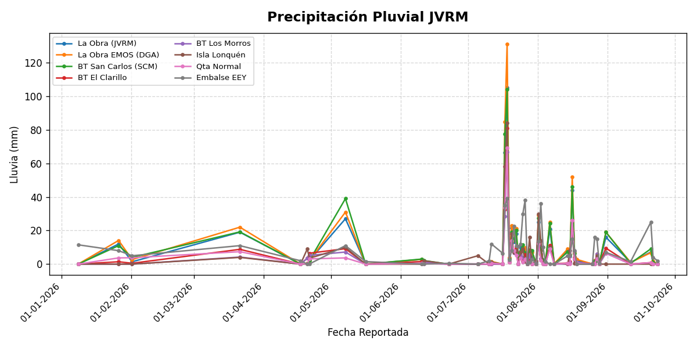
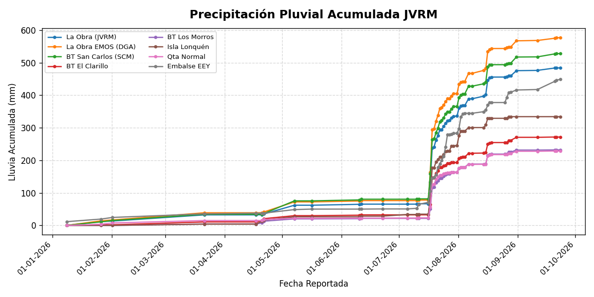
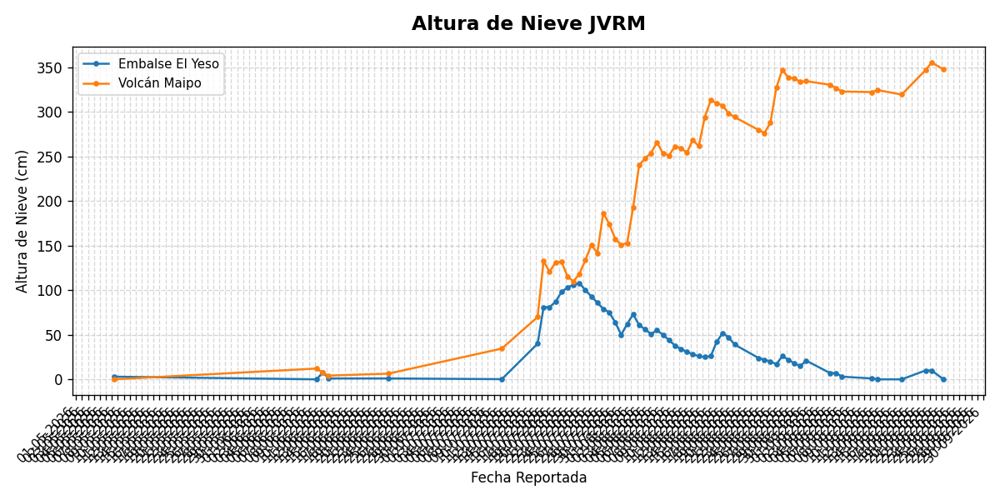

# 📊 Monitoreo de Caudales, Turbiedad y Precipitaciones - JVRM

Visualización de parámetros reportados por la Junta de Vigilancia de la 1a Sección del Río Maipo (JVRM).

> *Los gráficos se actualizan automáticamente.*

---

## Caudales (m³/s)

---

## Dotaciones (l/s/acc)

---

## Turbiedad (UNT)

---

## Precipitación Pluvial (mm)

---

## Precipitación Pluvial Acumulada (mm)

---

## Altura de Nieve (cm)

---

