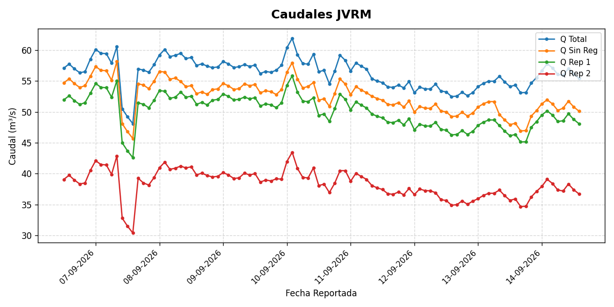
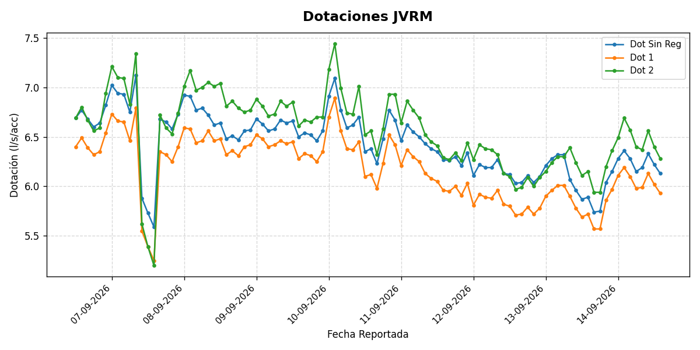
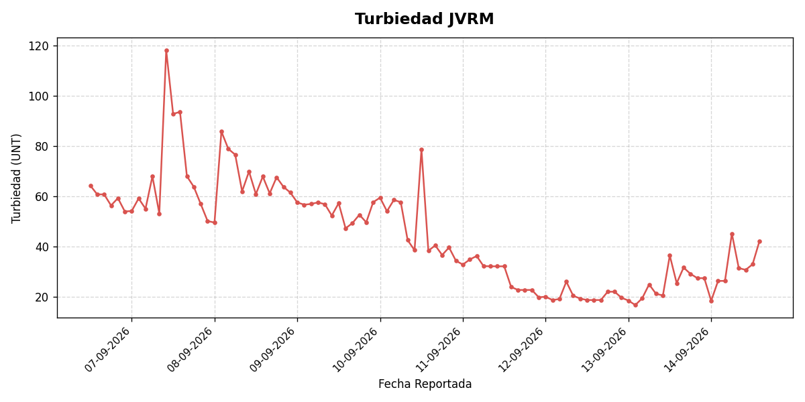

# 📊 Monitoreo de Caudales, Dotaciones y Turbiedad - JVRM

Visualización de parámetros reportados por la Junta de Vigilancia del Río Maipo (JVRM).

> *Los gráficos se actualizan cada 6 horas.*

---

## Caudales (m³/s)

---

## Dotaciones (l/s/acc)

---

## Turbiedad (UNT)

---

